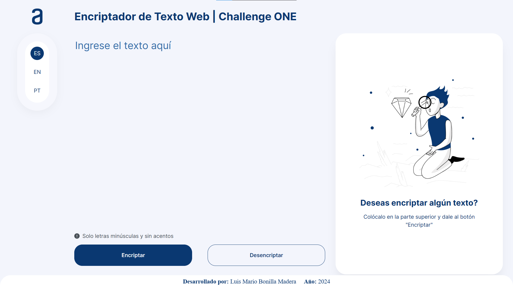
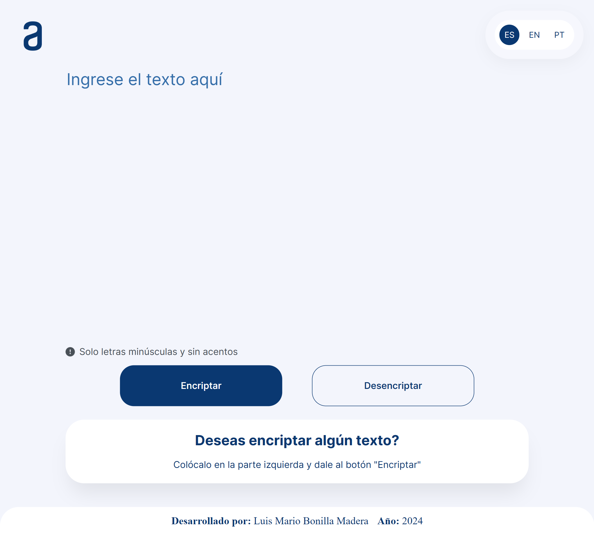

# Bienvenido/a al Repositorio de mi Encriptador Web

Este repositorio contiene los archivos necesarios para la creación e implementación del encriptador web. El objetivo principal de este proyecto es aplicar los conocimientos que adquirí a lo largo de los cursos que realice en la formación **Principiante en Programación G6 - ONE**, impartida por el equipo de [Alura LATAM](https://www.aluracursos.com), como parte de mi participación en el programa [ONE](https://www.oracle.com/lad/education/oracle-next-education) (Oracle Next Education).

El proyecto se encuentra en etapa de desarrollo. Durante esta fase, me encargaré de desarrollar la interfaz gráfica siguiendo los prototipos de pantalla proporcionados en el archivo de [Figma](https://www.figma.com/file/trP3p5nEh7XUyB3n2bomjP/Alura-Challenge---Desaf%C3%ADo-1---L%C3%B3gica?type=design&node-id=0-1&mode=design&t=CN0oLmGKgNSHYZUe-0) y de crear la lógica correspondiente basándome en las instrucciones detalladas en el archivo con las [instrucciones del challenge](Instrucciones_challenge.pdf) y [Trello](https://trello.com/b/WTdfcewC/encriptador-de-texto-alura-challenges-one), estos archivos son proporcionados por Alura LATAM.

Actualmente, he desarrollado la parte visual para dispositivos de escritorio o laptops y tablets, tengo planeado hacerlo aún más responsivo para pequeños dispositivos móviles (celulares inteligentes). Ya se encuentra totalmente funcional en las plataformas de escritorio o laptops y tablets.

## Características Principales

  - Se ha desarrollado una interfaz gráfica basada en los prototipos proporcionados por Alura LATAM, diseñados en Figma. La interfaz actualmente está diseñada para dispositivos de escritorio o laptops.
  - Lógica de encriptación y desencriptación utilizando diccionarios y expresiones regulares en JavaScript. Además, de la utilización de una función de validación para garantizar que el texto a encriptar o desencriptar no contenga mayúsculas ni caracteres especiales.
  - Se ha incluido la opción para cambiar el idioma de la interfaz entre español, inglés y portugués.

## Diseño responsivo

Las pruebas de la aplicación web se realizaron con éxito en las siguientes plataformas:
  - Escritorio y laptop (1025px - 1440px)
  - Tablet (601px - 1024px)

Falta desarrollar para esta plataforma:
  - Celular (Máx.: 600px)

## Estructura del proyecto

  - [`index.html`](index.html): Página principal de la aplicación, donde se define la estructura y contenido básico del sitio.
  - [`style.css`](style.css): Archivo que contiene las reglas de estilo CSS aplicadas a la interfaz de usuario para mejorar su apariencia y presentación.
  - [`reset.css`](reset.css): Reinicia los estilos predeterminados del navegador para garantizar una consistencia en el diseño entre navegadores.
  - [`script.js`](script.js): Contiene la lógica principal de la aplicación, incluyendo la función de validación, encriptación, desencriptación y el comportamiento responsivo del sitio.
  - [`img`](img/): Carpeta que contiene imágenes utilizadas en la aplicación.
  - [`screenshots`](screenshots/): Carpeta que almacena capturas de pantalla del progreso del proyecto.
  - [`LICENSE.md`](LICENSE.md): Archivo que contiene los términos de la licencia del proyecto.
  - [`README.md`](README.md): Este archivo, que proporciona una descripción detallada del proyecto y su estructura.
  - [`instruccionesChallenge.pdf`](instruccionesChallenge.pdf): Instrucciones detalladas proporcionadas por Alura LATAM para el desafío, en formato pdf.
  - [`instruccionesChallenge.md`](instruccionesChallenge.md): Instrucciones detalladas proporcionadas por Alura LATAM para el desafío, en formato de texto, escriot desde la card 'Sobre el desafío', del archivo de Trello.
  - [`.gitignore`](.gitignore): Archivo que especifica los archivos y carpetas que deben ignorarse en el control de versiones con Git.

## Tecnologías utilizadas

  - **HTML**: Se implementa de manera que asegure la semántica de la aplicación web, utilizando los elementos HTML de forma apropiada y significativa para estructurar y organizar el contenido.
  - **CSS**: Se utiliza para el estilado y posicionamiento de los elementos HTML, aplicando reglas de estilo CSS para mejorar la presentación visual de la interfaz de usuario.
  - **JavaScript**: Desarrollado para la lógica principal del encriptador web, incluyendo la implementación de la lógica de encriptación y desencriptación mediante diccionarios y expresiones regulares. Además, se utiliza para la función de validación que garantiza que el texto a encriptar o desencriptar no contenga mayúsculas ni caracteres especiales.

## Licencia

Este proyecto está bajo la [licencia MIT](LICENSE.md).

## Capturas de Pantalla

Vista previa del progreso actual del proyecto:
  - Laptop [1025px - 1440px]:
  

  - Tablet [601px - 1024px] (1024px * 767px):
  
  

## Recursos Externos

  - **Cursos de Alura LATAM:**
    1. [Lógica de Programación: sumérgete en la programación con JavaScript](https://www.aluracursos.com/curso-online-logica-programacion-sumergete-programacion-javascript)
    2. [Lógica de programación: explorar funciones y listas](https://www.aluracursos.com/curso-online-logica-programacion-explorar-funciones-listas)
    3. [HTML5 y CSS3 parte 1: Mi primera página web](https://www.aluracursos.com/curso-online-html5-css3-primera-pagina-web)
    4. [HTML5 y CSS3 parte 2: Posicionamiento, listas y navegación](https://www.aluracursos.com/curso-online-html5-css3-posicionamiento-listas-navegacion)
    5. [HTML5 y CSS3 parte 3: Trabajando con formularios y tablas](https://www.aluracursos.com/curso-online-html5-css3-formularios-tablas)
    6. [HTML5 y CSS3 parte 4: Avanzando en CSS](https://www.aluracursos.com/curso-online-html5-css3-avanzando-css)
    7. [Git y GitHub: repositorio, commit y versiones](https://www.aluracursos.com/curso-online-git-github-repositorio-commit-versiones)
  
  - **Archivos proporcionados por Alura LATAM:**
    1. [Prototipos de pantallas en Figma](https://www.figma.com/file/trP3p5nEh7XUyB3n2bomjP/Alura-Challenge---Desaf%C3%ADo-1---L%C3%B3gica?type=design&node-id=0-1&mode=design&t=CN0oLmGKgNSHYZUe-0)
    2. [Cards en Trello](https://trello.com/b/WTdfcewC/encriptador-de-texto-alura-challenges-one)
    3. [Instrucciones del Challenge](Instrucciones_challenge.pdf)

  - **Artículos adicionales**
    1. [<textarea> | MDN](https://developer.mozilla.org/es/docs/Web/HTML/Element/textarea)
    2. [Interact with the clipboard | MDN](https://developer.mozilla.org/en-US/docs/Mozilla/Add-ons/WebExtensions/Interact_with_the_clipboard)
    3. [Style display Property | W3 Schools](https://www.w3schools.com/jsref/prop_style_display.asp)
    4. [margin | MDN](https://developer.mozilla.org/es/docs/Web/CSS/margin)
    5. [Expresiones Regulares | MDN](https://developer.mozilla.org/es/docs/Web/JavaScript/Guide/Regular_expressions)