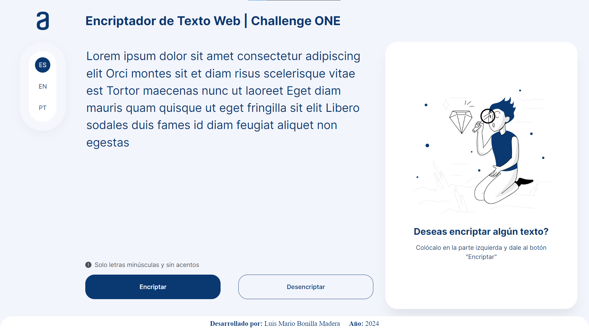

# Bienvenido/a al Repositorio de mi Encriptador Web

Este repositorio contiene los archivos necesarios para la creación e implementación del encriptador web. El objetivo principal de este proyecto es aplicar los conocimientos que adquirí a lo largo de los cursos que realice en la formación <b>Principiante en Programación G6 - ONE</b>, impartida por el equipo de [Alura LATAM](https://www.aluracursos.com), como parte de mi participación en el programa [ONE](https://www.oracle.com/lad/education/oracle-next-education) (Oracle Next Education).

El proyecto se encuentra en etapa de desarrollo. Durante esta fase, me encargaré de desarrollar la interfaz gráfica siguiendo los prototipos de pantalla proporcionados en el archivo de [Figma](https://www.figma.com/file/trP3p5nEh7XUyB3n2bomjP/Alura-Challenge---Desaf%C3%ADo-1---L%C3%B3gica?type=design&node-id=0-1&mode=design&t=CN0oLmGKgNSHYZUe-0) y de crear la lógica correspondiente basándome en las instrucciones detalladas en el archivo con las [instrucciones del challenge](Instrucciones_challenge.pdf) y [Trello](https://trello.com/b/WTdfcewC/encriptador-de-texto-alura-challenges-one), estos archivos son proporcionados por Alura LATAM.

Actualmente, he desarrollado la parte visual para dispositivos de escritorio o laptops, tengo planeado hacerlo aún más responsivo para dispositivos móviles (tablets y celulares inteligentes), sin embargo, antes de centrarme a seguir con la parte visual, me centraré a realizar la parte lógica, para tener el sitio web funcional en de escritorio o laptops.

## Características Principales

- Se ha desarrollado una interfaz gráfica basada en los prototipos proporcionados por Alura LATAM, diseñados en Figma. La interfaz actualmente está diseñada para dispositivos de escritorio o laptops.
- Se ha avanzado en la implementación de la lógica de encriptación y desencriptación utilizando JavaScript. Creando una función de validación para garantizar que el texto a encriptar no contenga mayúsculas ni caracteres especiales.
- Se ha incluido la opción para cambiar el idioma de la interfaz entre español, inglés y portugués.

## Estructura del proyecto

- `index.html`: Página principal de la aplicación, donde se define la estructura y contenido básico del sitio.
- `style.css`: Este archivo contiene las reglas de estilo CSS que se aplican a la interfaz de usuario para mejorar su apariencia y presentación.
- `reset.css`: Reinicia los estilos predeterminados del navegador para garantizar una consistencia en el diseño entre navegadores.
- `script.js`: Aquí se encuentra la lógica principal de la aplicación, incluida la función de validación y el comportamiento responsivo del sitio.
- `img`: Carpeta que contiene imágenes utilizadas en la aplicación.
- `screenshots`: Carpeta que almacena capturas de pantalla del progreso del proyecto.
- `LICENSE.md`: Archivo que contiene los términos de la licencia del proyecto.
- `README.md`: Este archivo, que proporciona una descripción detallada del proyecto y su estructura.
- `Instrucciones_challenge.pdf`: Instrucciones detalladas proporcionadas por Alura LATAM para el desafío.
- `.gitignore`: Archivo para especificar archivos y carpetas que deben ignorarse en el control de versiones con Git.

## Tecnologías utilizadas

- <b>HTML</b>: Es importante destacar que el HTML se implementa de manera que asegure la semántica de la aplicación web, lo que significa que se utilizan los elementos HTML de forma apropiada y significativa para estructurar y organizar el contenido.
- <b>CSS</b>: Se utiliza para el estilado y posicionamiento de los elementos HTML, lo que implica que se aplican reglas de estilo CSS para mejorar la presentación visual de la interfaz de usuario.
- <b>JavaScript</b>: Además de la creación de la función de validación, JavaScript se utiliza para mantener el tamaño del contenedor principal (`main`) en función de la altura del monitor utilizado, lo que sugiere un enfoque de diseño responsivo y adaptable.

## Licencia

Este proyecto está bajo la [licencia MIT](LICENSE.md).

## Capturas de Pantalla

Vista previa del progreso actual del proyecto:

## Recursos Externos

- Cursos de Alura LATAM:
  1. [Lógica de Programación: sumérgete en la programación con JavaScript](https://www.aluracursos.com/curso-online-logica-programacion-sumergete-programacion-javascript)
  2. [Lógica de programación: explorar funciones y listas](https://www.aluracursos.com/curso-online-logica-programacion-explorar-funciones-listas)
  3. [HTML5 y CSS3 parte 1: Mi primera página web](https://www.aluracursos.com/curso-online-html5-css3-primera-pagina-web)
  4. [HTML5 y CSS3 parte 2: Posicionamiento, listas y navegación](https://www.aluracursos.com/curso-online-html5-css3-posicionamiento-listas-navegacion)
  5. [HTML5 y CSS3 parte 3: Trabajando con formularios y tablas](https://www.aluracursos.com/curso-online-html5-css3-formularios-tablas)
  6. [HTML5 y CSS3 parte 4: Avanzando en CSS](https://www.aluracursos.com/curso-online-html5-css3-avanzando-css)
  7. [Git y GitHub: repositorio, commit y versiones](https://www.aluracursos.com/curso-online-git-github-repositorio-commit-versiones)
 
- Archivos proporcionados por Alura LATAM:
  1. [Prototipos de pantallas en Figma](https://www.figma.com/file/trP3p5nEh7XUyB3n2bomjP/Alura-Challenge---Desaf%C3%ADo-1---L%C3%B3gica?type=design&node-id=0-1&mode=design&t=CN0oLmGKgNSHYZUe-0)
  2. [Cards en Trello](https://trello.com/b/WTdfcewC/encriptador-de-texto-alura-challenges-one)
  3. [Instrucciones del Challenge](Instrucciones_challenge.pdf)

