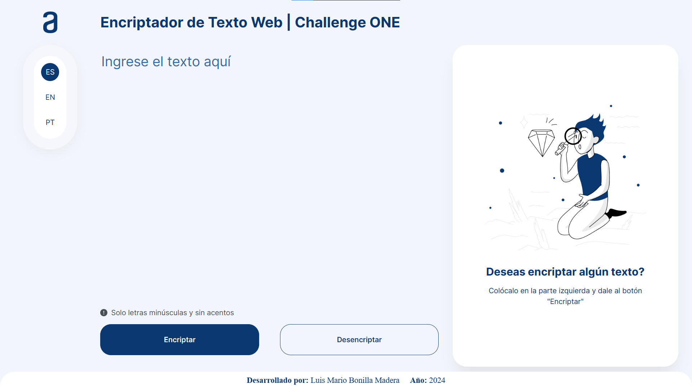
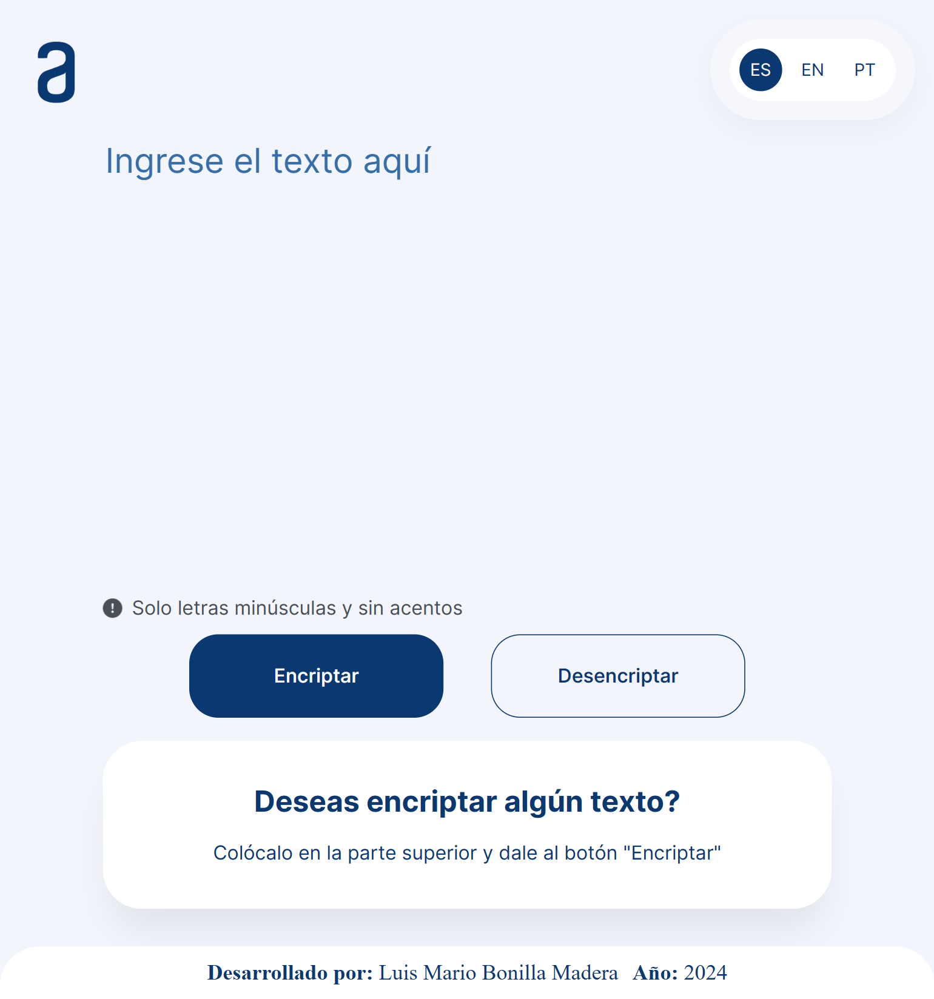
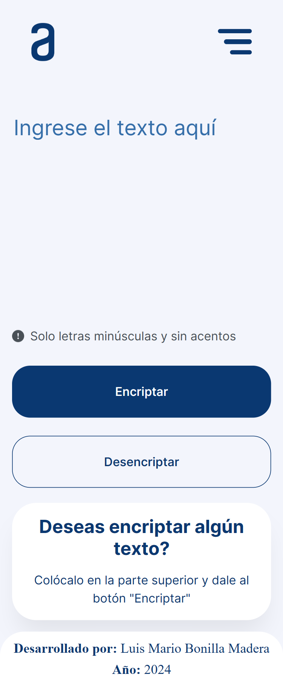

# Encriptador Web: Proyecto Finalizado

¡Bienvenido/a al repositorio del Encriptador Web! Este proyecto es el resultado de mi participación en el programa **Principiante en Programación G6 - ONE**, ofrecido por [Alura LATAM](https://www.aluracursos.com) en colaboración con [Oracle Next Education](https://www.oracle.com/lad/education/oracle-next-education). Aquí encontrarás todos los recursos y el código fuente necesario para implementar y comprender el funcionamiento de este encriptador de texto.

## Acerca del Proyecto

El Encriptador Web es una aplicación diseñada para cifrar y descifrar mensajes utilizando un algoritmo de encriptación básico. La interfaz y la lógica del proyecto se desarrollaron siguiendo las especificaciones del [desafío propuesto por Alura LATAM](https://www.aluracursos.com/challenges/challenge-one-logica/sprint01-construye-un-encriptador-texto-con-javascript), utilizando prototipos de diseño en Figma y una serie de instrucciones detalladas para cumplir con los objetivos de aprendizaje establecidos.

### Características Destacadas

- **Interfaz Responsiva**: Optimizada para escritorio, laptops, tablets y dispositivos móviles, garantizando una experiencia de usuario excelente en cualquier dispositivo.
- **Soporte Multilenguaje**: Disponible en español, inglés y portugués, facilitando su uso a usuarios de diversas regiones.
- **Seguridad de Datos**: Implementa un sistema de encriptación y desencriptación robusto, con validaciones para asegurar que el texto ingresado sea válido (sin mayúsculas ni caracteres especiales).

### Tecnologías Implementadas

- **HTML5**: Proporciona una estructura semántica clara y accesible.
- **CSS3**: Ofrece estilos avanzados y diseño responsivo.
- **JavaScript (ES6+)**: Encargado de la lógica de encriptación/desencriptación y la interactividad de la interfaz.

## Estructura del Repositorio

Aquí una breve descripción de los componentes principales del proyecto:

- `index.html`: Punto de entrada de la aplicación. Establece la estructura básica del sitio.
- `style.css` y `reset.css`: Archivos CSS para estilos y normalización entre navegadores.
- `script.js`: Contiene la lógica principal de encriptación, desencriptación y validaciones.
- `img/`: Directorio para las imágenes utilizadas en la aplicación.
- `screenshots/`: Capturas de pantalla que muestran el diseño responsivo en diferentes dispositivos.
- `LICENSE.md`: Información sobre la licencia bajo la cual se distribuye el proyecto.
- `README.md`: Documentación del proyecto (este archivo).
- `instruccionesChallenge` (`.pdf` y `.md`): Instrucciones detalladas del desafío.

## Vista Previa del Proyecto

A continuación, algunas imágenes representativas del proyecto en distintos dispositivos:

### Versión de Escritorio - Laptop (1025px - 1920px):

  

### Versión Tablet (601px - 1024px):

  

### Versión Dispositivo Móvil (260px - 600px):

  

## Cómo Contribuir

Si estás interesado/a en contribuir al proyecto, ¡tu ayuda es bienvenida! Considera forkear el repositorio, realizar tus cambios y enviar un pull request. Si tienes alguna sugerencia o encuentras algún error, no dudes en abrir un issue en el repositorio.

## Agradecimientos y Recursos

Un agradecimiento especial a Alura LATAM y Oracle Next Education por proporcionar los materiales y el desafío que hicieron posible este proyecto. A continuación, algunos recursos externos que fueron de gran ayuda:

- **Cursos de Alura LATAM:**
    1. [Lógica de Programación: sumérgete en la programación con JavaScript](https://www.aluracursos.com/curso-online-logica-programacion-sumergete-programacion-javascript)
    2. [Lógica de programación: explorar funciones y listas](https://www.aluracursos.com/curso-online-logica-programacion-explorar-funciones-listas)
    3. [HTML5 y CSS3 parte 1: Mi primera página web](https://www.aluracursos.com/curso-online-html5-css3-primera-pagina-web)
    4. [HTML5 y CSS3 parte 2: Posicionamiento, listas y navegación](https://www.aluracursos.com/curso-online-html5-css3-posicionamiento-listas-navegacion)
    5. [HTML5 y CSS3 parte 3: Trabajando con formularios y tablas](https://www.aluracursos.com/curso-online-html5-css3-formularios-tablas)
    6. [HTML5 y CSS3 parte 4: Avanzando en CSS](https://www.aluracursos.com/curso-online-html5-css3-avanzando-css)
    7. [Git y GitHub: repositorio, commit y versiones](https://www.aluracursos.com/curso-online-git-github-repositorio-commit-versiones)

- **Archivos proporcionados por Alura LATAM:**
    1. [Prototipos de pantallas en Figma](https://www.figma.com/file/trP3p5nEh7XUyB3n2bomjP/Alura-Challenge---Desaf%C3%ADo-1---L%C3%B3gica?type=design&node-id=0-1&mode=design&t=CN0oLmGKgNSHYZUe-0)
    2. [Cards en Trello](https://trello.com/b/WTdfcewC/encriptador-de-texto-alura-challenges-one)
    3. [Instrucciones del Challenge](instruccionesChallenge.pdf)

- **Páginas externas:**
    1. [MDN Web Docs](https://developer.mozilla.org/)
    2. [W3 Schools](https://www.w3schools.com/)

## Licencia

Este proyecto se distribuye bajo la [Licencia MIT](LICENSE.md), lo que permite su uso, modificación y distribución de manera libre.