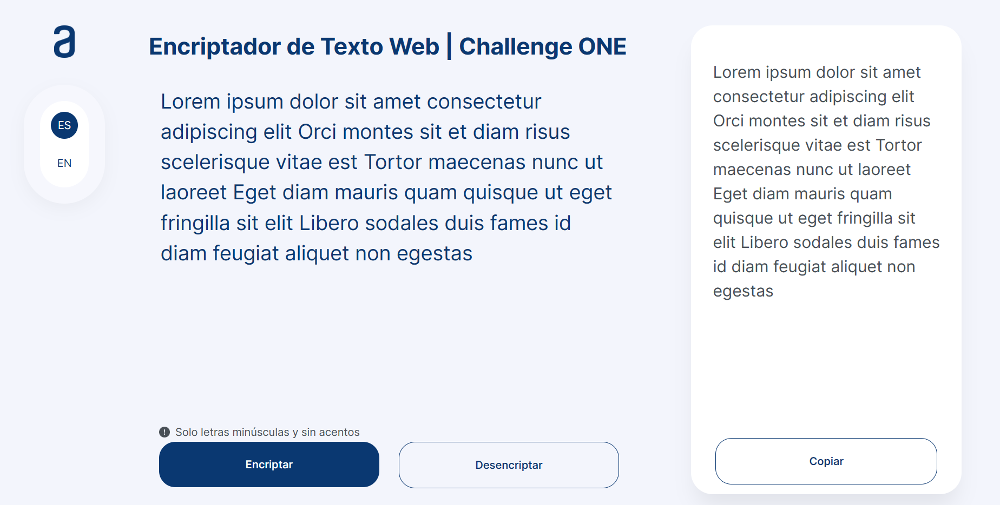

# Bienvenido al Repositorio del Encriptador Web

Este repositorio contiene los archivos necesarios para la creación e implementación del encriptador web. El objetivo principal de este proyecto es aplicar los conocimientos que adquirí a lo largo de los cursos que realice en la formación <b>Principiante en Programación G6 - ONE</b>, impartida por el equipo de [Alura LATAM](https://www.aluracursos.com), como parte de mi participación en el programa [ONE](https://www.oracle.com/lad/education/oracle-next-education) (Oracle Next Education).

Actualmente, el proyecto se encuentra en etapa de desarrollo. Durante esta fase, me encargaré de desarrollar la interfaz gráfica siguiendo los prototipos de pantalla proporcionados en el archivo de [Figma](https://www.figma.com/file/trP3p5nEh7XUyB3n2bomjP/Alura-Challenge---Desaf%C3%ADo-1---L%C3%B3gica?type=design&node-id=0-1&mode=design&t=CN0oLmGKgNSHYZUe-0) y de crear la lógica correspondiente basándome en las instrucciones detalladas en el archivo con las [instrucciones del challenge](Instrucciones_challenge.pdf) y [Trello](https://trello.com/b/WTdfcewC/encriptador-de-texto-alura-challenges-one), ambos archivos son proporcionados por Alura LATAM.

## Características Principales

- Interfaz gráfica basada en los prototipos proporcionados por Alura LATAM, diseñados en Figma.
- Implementación de lógica de encriptación y desencriptación en JavaScript.
- Opción para cambiar el idioma de la interfaz, entre inglés y español.

## Estructura del proyecto

- `index.html`: Página principal de la aplicación (en desarrollo).
- `style.css`: Estilos para la presentación del proyecto (en desarrollo).
- `reset.css`: Reinicio de los estilos predeterminado del navegador.
-  `script.js`: Código que se utilizara para impulsar la lógica del encriptador.
- `img`: Carpeta con las imágenes utilizadas en el proyecto.
- `LICENSE.md`: Licencia en la que está sujeto el proyecto.
- `README.md`: Este archivo, el cual explica de que trata el proyecto.
- `screenshots`: Carpeta con las capturas de pantalla con el progreso del proyecto.
-  `Instrucciones_challenge`: PDF con las instrucciones a seguir para lograr el desafío.

## Tecnologías utilizadas

- HTML
- CSS
- JavaScript

## Licencia

Este proyecto está bajo la [licencia MIT](LICENSE.md).

## Capturas de Pantalla

Aquí hay una vista previa visual del progreso actual del proyecto:

## Recursos Externos

- Cursos de Alura LATAM:
  1. [Lógica de Programación: sumérgete en la programación con JavaScript](https://www.aluracursos.com/curso-online-logica-programacion-sumergete-programacion-javascript)
  2. [Lógica de programación: explorar funciones y listas](https://www.aluracursos.com/curso-online-logica-programacion-explorar-funciones-listas)
  3. [HTML5 y CSS3 parte 1: Mi primera página web](https://www.aluracursos.com/curso-online-html5-css3-primera-pagina-web)
  4. [HTML5 y CSS3 parte 2: Posicionamiento, listas y navegación](https://www.aluracursos.com/curso-online-html5-css3-posicionamiento-listas-navegacion)
  5. [HTML5 y CSS3 parte 3: Trabajando con formularios y tablas](https://www.aluracursos.com/curso-online-html5-css3-formularios-tablas)
  6. [HTML5 y CSS3 parte 4: Avanzando en CSS](https://www.aluracursos.com/curso-online-html5-css3-avanzando-css)
  7. [Git y GitHub: repositorio, commit y versiones](https://www.aluracursos.com/curso-online-git-github-repositorio-commit-versiones)
 
- Archivos proporcionados por Alura LATAM:
  1. [Prototipos de pantallas en Figma](https://www.figma.com/file/trP3p5nEh7XUyB3n2bomjP/Alura-Challenge---Desaf%C3%ADo-1---L%C3%B3gica?type=design&node-id=0-1&mode=design&t=CN0oLmGKgNSHYZUe-0)
  2. [Cards en Trello](https://trello.com/b/WTdfcewC/encriptador-de-texto-alura-challenges-one)
  3. [Instrucciones del Challenge](Instrucciones_challenge.pdf)

